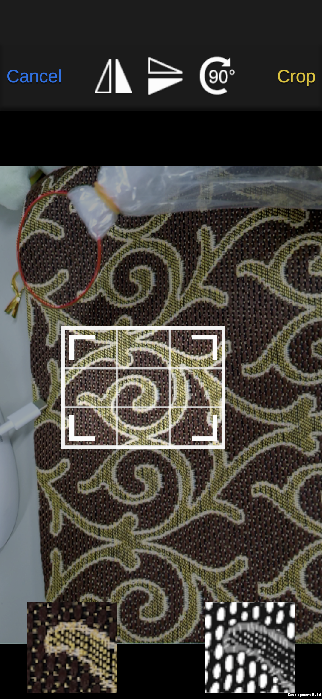

# Depth Map Estimation of Single-View Image using Smartphone Camera for a 3-Dimension Image Generation in Augmented Reality
 

## Overview
Some functions are added into AR Depth Lab (https://github.com/googlesamples/arcore-depth-lab) in a personal computer (PC). Then, the improve AR Depth Lab is installed into the smartphone. The depth map can be obtained
by using patch-based depth estimation and saved into the smartphone. The, you can geneate 3D point cloud from the depth map in Generation Scene.
## Requirement
Unity2020.3.6f1, ARCore Extension, AR Foundation

## Usage

## Features

## Reference

## Author
Jun'nosuke Takarabe

## Licence
